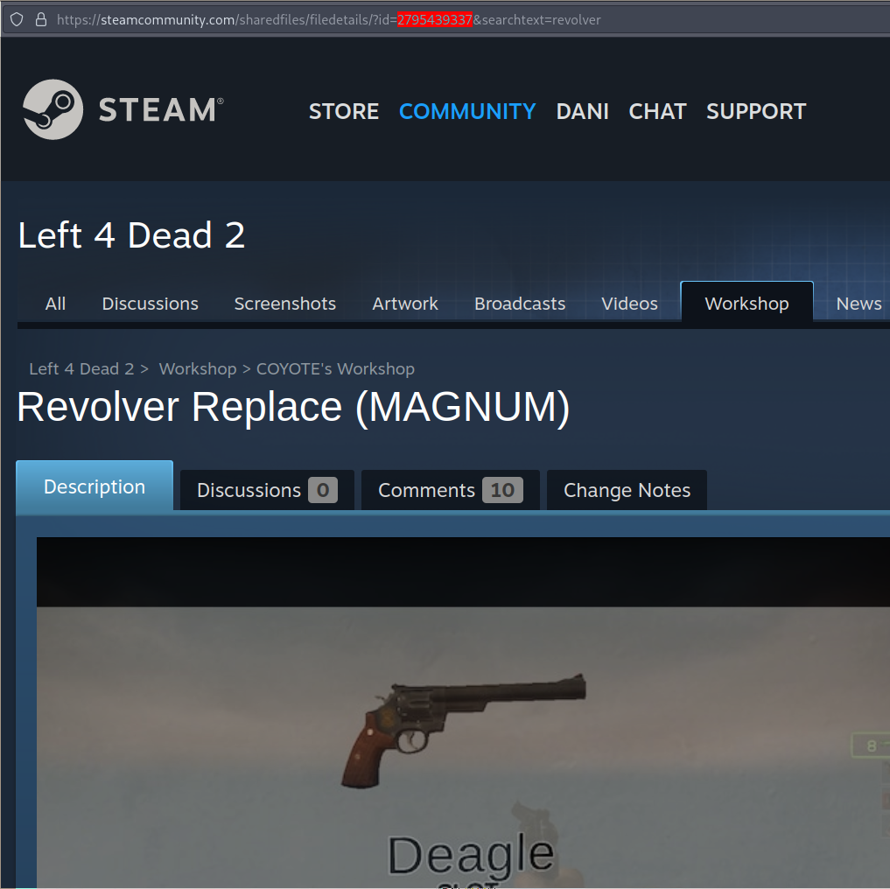
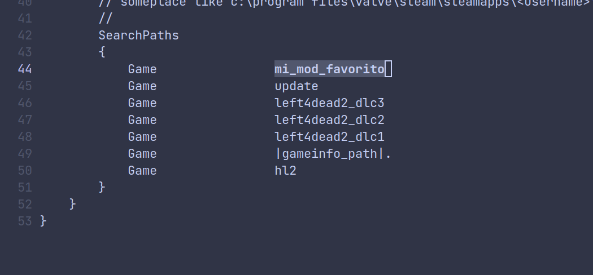
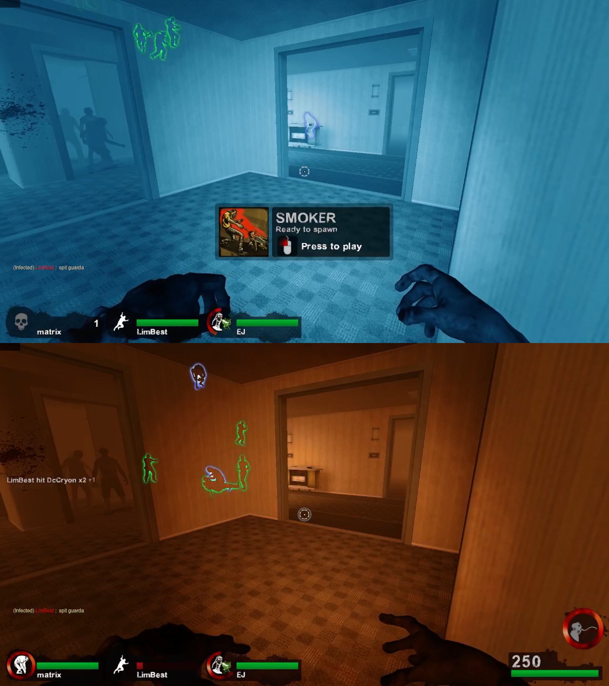
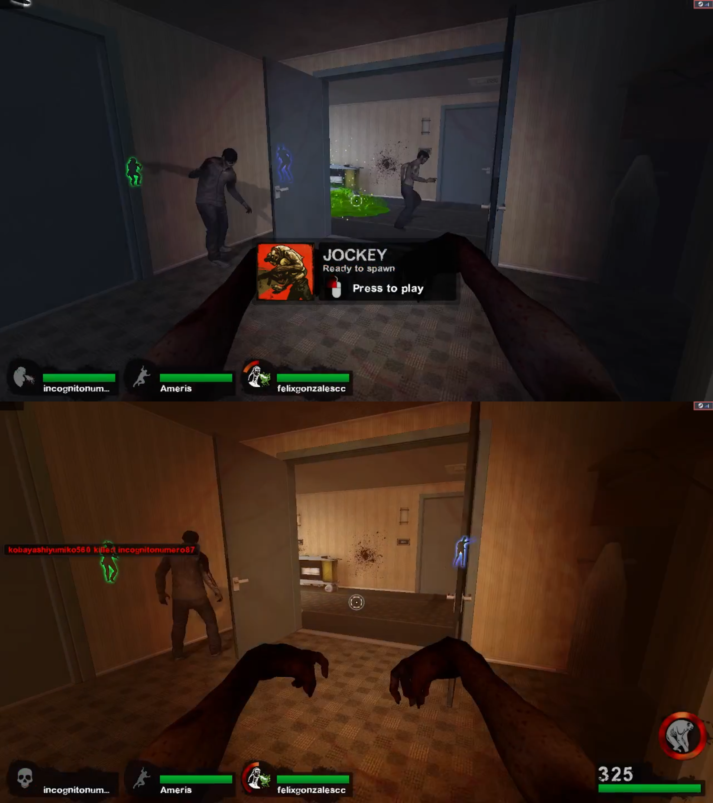

# Acerca De
Repositorio donde guardo mi autoexec.cfg y mis mods en un unico archivo vpk.

* [Como usar mods en versus](#como-usar-mods-en-versus)
* [Como crear un apk propio](#como-crear-un-vpk-propio)

NOTA: No es necesario saber como crear un vpk propio para poder usar
mods en versus. Tambien algunos servers piden consistencia con el archivo
gameinfo.txt, asi que no es posible usar mods en esos. Pero para servers
oficiales si funciona.

## Como usar mods en versus
Llamemos **$root_dir** al folder donde esta instalado Left4Dead2.
Se puede saber donde queda este folder dandole anti-click al juego en Steam
y seleccionando la opcion adecuada.

Los archivos vpk descargados del workshop de steam se encuentran en
**$root_dir/left4dead2/addons/workshop**. Los nombres de estos son sus codigos
en el workshop, que se encuentran en la url despues de 'id=':

Ademas, hay una imagen del mismo nombre en el folder que puede ayudar a
identificarlos.

Para usar addons en versus, (1) se crea un folder cualquiera **"$root_dir/mi_mod_favorito"**
y se pone el vpk dentro de este. Pero el vpk necesita ser re-nombrado a
"pak01_dir.vpk". (2) Despues, se edita la ultima parte del archivo
**"$root_dir/left4dead2/gameinfo.txt"** para que incluya mi mod.



Como se pudo ver, en esa seccion se especifican folders que sobreescriben
los archivos del juego de abajo a arriba. Estos folders se encuentran
en **$root_dir**. Como se muestra en la imagen, el folder "hl2" (Half-Life 2)
es la base del juego;
despues |gameinfo_path| (que es el folder **$root_dir/left4dead2**)
sobreescribe hl2. Y asi sucesivamente con los dlc's.

Con esto, podemos poner cuantos mods se deseen. Si se espera guardar todos estos
mods, se recomienta [crear un vpk](#Como-crear-un-vpk-propio) que junte todo
en un solo vpk.


## Como crear un vpk propio
Un archivo vpk es similar a un zip o rar: es la compresion de un folder de archivos.
La primera parte de este [video](https://www.youtube.com/watch?v=Nv9sOw4rako)
explica la forma mas practica para extraer, juntar y comprimir vpk's.

Alternativamente, si se cuenta con python y una linea de comandos (cmd en windows),
entonces se puede installar el programa 'vpk' con:
```
$ pip install vpk
```

Para extraer los contenidos de un archivo vpk:
```
$ vpk -x folder_de_salida addon.vpk
```

Si "folder_de_salida" no existe, se crea uno.

Una ves hecho esto se puede unir los archivos arrastrando los contenidos de cada
"folder_de_salida" a un nuevo folder, llamemoslo "compilacion". Si hay dos o mas
mods que modifican una misma caracteristica del juego, entonces se
sobreescribirian. O sea, el ultimo mod a ser copiado en "compilacion" seria el
que que cuente.


Para comprimir el folder:
```
$ vpk -c compilacion -cv 1  nombre.vpk
```

## Addons usados
[TODO: Poner screenshot y/o video como superviviente]

- [Custom Crosshair White Dot (small)](
    https://steamcommunity.com/sharedfiles/filedetails/?id=121339654
)
- [Silenced Weapons Sounds Mod](
    https://steamcommunity.com/sharedfiles/filedetails/?id=137443116
)
- [CrazyRabbit's Tactical Flashlight](
    https://steamcommunity.com/sharedfiles/filedetails/?id=121094109
)
- [NeunGUI](
    https://steamcommunity.com/sharedfiles/filedetails/?id=121091252
)
- [SidePanel for NeunGUI](
    https://steamcommunity.com/sharedfiles/filedetails/?id=121123376
)
- [Vocalizador (custom)](
    https://steamcommunity.com/sharedfiles/filedetails/?id=1224992309
)

Tambien inclui archivos de correccion para cuando eres infectado
( se ve menos azul y naranja ).


Default                    | Custom
:-------------------------:|:-------------------------:
    |  

Y tambien inclui un archivo de spray en
**materials/vgui/logos/custom/spray_danidev.vtf**.
Importacion en Linux:
Primero tratar de importar el spray en **Opciones > Multijugador > Importar
Spray** y tipear nombre.vtf.
Segundo, ir a **Opciones > Multijugador > Imagen Spray > Custom** y tipear
nombre.vtf.

NOTA: Si se quiere renombrar el archivo del spray, se tiene que editar el
archivo *.vmt para que este conforme al cambio.


## Fuentes
Copie y modifique la mayoria de mi autoexec de
https://github.com/theletterjwithadot/Ultimate-Config-for-L4D2.
Ahi tambien estan los archivos de correccion que use.

Donde originalmente aprendi a usar mods en versus:
https://www.youtube.com/watch?v=Nv9sOw4rako

Sprays en Linux
https://doitonlinux.blogspot.com/2015/04/custom-spray-in-l4d2.html
https://rafradek.github.io/Mishcatt/

